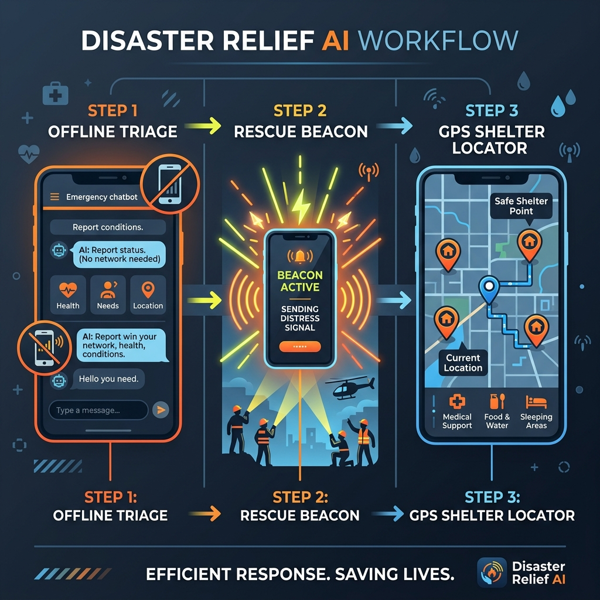
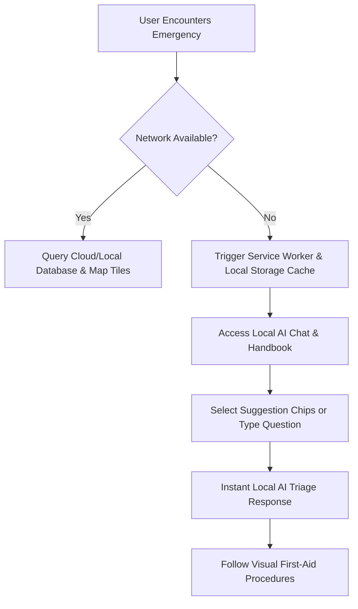
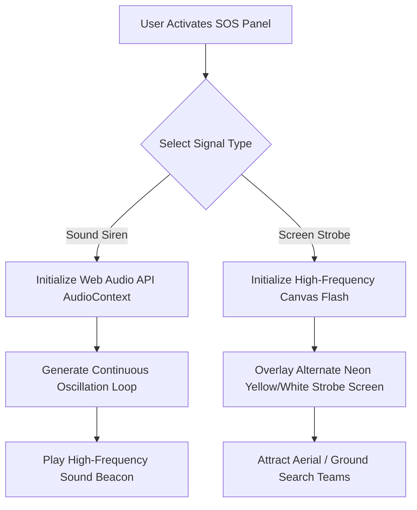

# Disaster Relief AI - Offline-First Emergency Assistant

[](./)
[](LICENSE)

**Disaster Relief AI** is an offline-first Progressive Web Application (PWA) designed to serve as a survival and rescue assistant during catastrophic events (floods, earthquakes, cyclones) when network connectivity is compromised. Built using lightweight, highly-optimized vanilla web technologies, the application operates entirely within the browser sandbox even without cellular service.



---


# 🚨 Disaster Relief AI

An offline-first emergency assistant designed to help people during disasters.

## 🌐 Live Demo [Deployment]

https://disaster-relief-ai-two.vercel.app

## 📂 GitHub Repository

https://github.com/LakshChinchmalatpure/Disaster-Relief-AI

## 🌟 Key Features

1. **🤖 Offline AI Triage Chatbot**
   - An in-browser intelligent triage assistant capable of providing immediate survival answers (e.g., CPR steps, bleeding control, water purification).
   - Works fully offline using pre-cached rule matrices and local logic.

2. **🚨 Acoustic Locator Beacon (SOS Siren)**
   - Emits a high-frequency, high-decibel audio signal utilizing the browser's Web Audio API.
   - Designed to guide rescue dogs and search teams to trapped individuals.
   - Adjustable pitch/intensity sliders for optimal acoustics.

3. **💡 Visual Rescue Strobe Flasher**
   - Rapidly flashes the screen with alternating high-contrast safety colors (neon yellow/white).
   - Serves as a visual beacon to attract aerial rescue helicopters or ground teams in low-visibility environments.

4. **🗺️ Interactive Map & Shelter Finder**
   - Integrates Leaflet.js to pinpoint emergency shelter coordinates.
   - Features an elegant offline fallback page listing shelter names, distances, and landmarks when map tiles fail to load.
   - Geolocation GPS tracking to identify immediate safe zones.

5. **🩹 First-Aid Handbook**
   - A highly-scannable, high-contrast, offline-accessible guide for critical procedures: CPR, severe bleeding, thermal/chemical burns, choking, and fractures.
   - Multi-lingual support (Hindi, English, Bengali, Marathi) for rapid deployment in local contexts.

6. **✅ Survival & Evacuation Checklists**
   - Interactive, categorized checklists (e.g., Monsoon Flood Prep, Earthquake Grab-Bag).
   - Saves progress locally inside the browser's `localStorage` to ensure persistence across reboots.

7. **📨 SOS Message Builder**
   - Gathers user safety status and GPS coordinates to compile a concise emergency message.
   - One-tap links to dispatch via SMS or WhatsApp once brief connectivity is restored.

---

## ⚙️ Core Workflows

### 1. Emergency Triage Decision Flow
This diagram illustrates how a user accesses medical or survival instructions offline:



### 2. SOS Beacon & Signal Activation Flow
This diagram illustrates the operation of the acoustic and visual signal locators:



---

## 🛠️ Setup and Installation

Since Disaster Relief AI is built with vanilla HTML/CSS/JavaScript and registered as a PWA, it does not require complex build steps or dependencies.

### Prerequisites
- Any modern web browser (Chrome, Safari, Firefox, Edge).
- A local web server to serve the service worker correctly.

### Local Execution

1. **Clone the Repository:**
   ```bash
   git clone https://github.com/LakshChinchmalatpure/Disaster-Relief-AI.git
   cd Disaster-Relief-AI
   ```

2. **Start a Local Web Server:**
   You can serve the directory using Python, Node.js, or any static hosting server:
   
   *Using Python (3.x):*
   ```bash
   python -m http.server 8000
   ```
   
   *Using Node.js (`serve`):*
   ```bash
   npx serve .
   ```

3. **Access the App:**
   Open your browser and navigate to `http://localhost:8000` (or the port specified by your server).

4. **Install as PWA (Optional):**
   Click the install icon in the address bar to add the application to your mobile home screen or desktop for native offline execution.

---

## 📱 Technology Stack
- **Structure:** Semantic HTML5 with PWA Manifest.
- **Styling:** Vanilla CSS3 utilizing a custom high-visibility safety HSL color palette.
- **Interactions & Web Audio:** Vanilla ES6 JavaScript.
- **Maps:** LeafletJS (for location plotting).
- **Service Worker:** Native PWA caching for offline-first assets.
- **Iconography:** High-contrast unicode and generated SVG elements.

---

## 📄 License
This project is licensed under the MIT License - see the LICENSE file for details.
