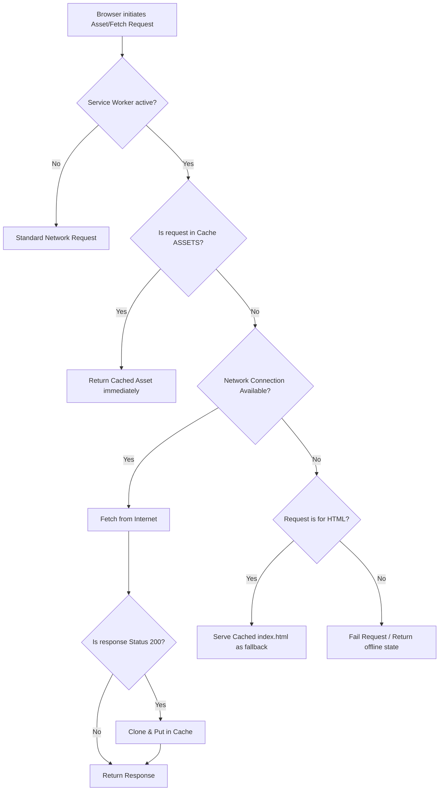
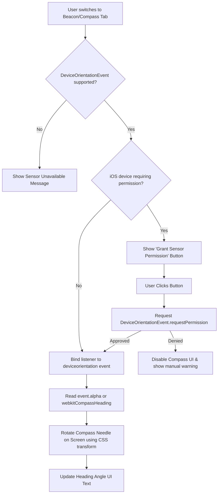
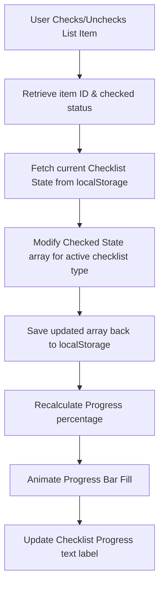
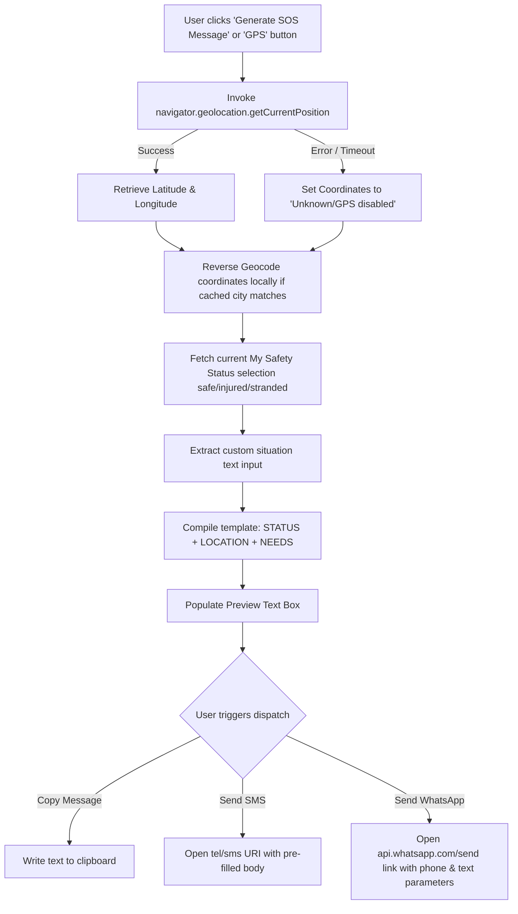
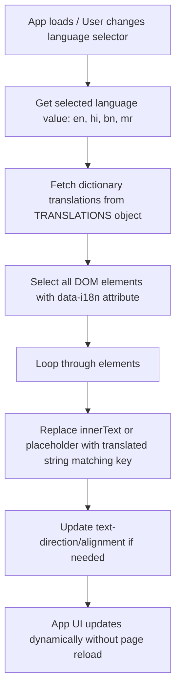

# Disaster Relief AI - Detailed Project Documentation & System Flows

This document provides a comprehensive overview of the architecture, subsystems, and execution flows for **Disaster Relief AI**. It details how the application maintains an offline-first state, utilizes device sensors, manages localized data persistence, and builds emergency communications.

---

## 🏗️ Architectural Overview

Disaster Relief AI is structured as a single-page progressive web application (PWA) with a decoupled caching layer (service worker) and UI controller logic. Since it is designed to run in disaster-stricken areas with zero network availability, all core assets—including HTML skeleton, CSS styling, Javascript behavior, and Leaflet map libraries—are cached locally upon the app's first visit.

```
                    ┌────────────────────────┐
                    │     User Browser       │
                    └───────────┬────────────┘
                                │
                  Intercepts all HTTP GETs
                                │
                                ▼
                    ┌────────────────────────┐
                    │    Service Worker      │
                    └───────────┬────────────┘
                                │
             ┌──────────────────┴──────────────────┐
      Cache Match?                          Cache Miss?
             │                                     │
             ▼                                     ▼
┌────────────────────────┐            ┌────────────────────────┐
│     Cache Storage      │            │   External Network     │
│ (v1 Static Assets &    │            │ (Loads live tiles &    │
│  Leaflet Libraries)    │            │  triage updates)       │
└────────────────────────┘            └────────────────────────┘
```

---

## ⚙️ Core System Flow Diagrams

Here are the detailed flowcharts describing the logic behind the app's primary features:

### 1. Service Worker Caching & Request Interception (PWA Offline First)
This flowchart explains how the service worker intercepts requests, checks the cache first, updates resources dynamically, and serves the emergency app shell even when network queries fail completely.



---

### 2. Compass & Sensor Orientation Flow
The compass navigation operates without cell service by accessing the device's internal magnetometer and accelerometer sensors. This flow details the runtime sensor binding, platform checking (iOS vs Android), and permission model.



---

### 3. Survival Checklist Persistence Flow
Checklists allow users to keep track of evacuation preparations. This flow explains how checkbox updates are tracked, computed, and persisted to client-side storage so that progress is retained across device reboots or application restarts.



---

### 4. SOS Message Builder & Coordinate Flow
The SOS message builder creates an emergency template containing the user's health status, coordinates, and custom requirements. This flow demonstrates coordinates retrieval and dispatch formatting.



---

### 5. Internationalization / Multi-lingual Translation Flow
To serve diverse populations during emergency relief, the UI supports dynamic client-side translations. This flow shows how language switches are applied immediately without requiring a network refresh.



---

## 📱 Subsystems Interaction Matrix

The table below illustrates how different pages and controls access device APIs and data storage:

| Feature / Tab | Browser Sensor API | Caching / Local Storage | External Network Dependency | Multi-lingual Support |
| :--- | :--- | :--- | :--- | :--- |
| **Dashboard** | None | Read Safety Status | None | Yes |
| **Map & Shelters** | GPS Geolocation | Leaflet CSS/JS Cache | OpenStreetMap tiles (Optional) | Yes |
| **AI Triage** | None | Cache Search | None (local fallback rule matrix) | Yes |
| **First Aid** | None | Local Content Cache | None | Yes |
| **Checklist** | None | LocalStorage Read/Write | None | Yes |
| **Rescue Beacon** | Web Audio API | None | None | Yes |
| **Compass** | Magnetometer / Sensor | None | None | Yes |
| **SOS Builder** | GPS Geolocation | Clipboard Copy | Tel/Cellular network (SMS/WhatsApp) | Yes |
